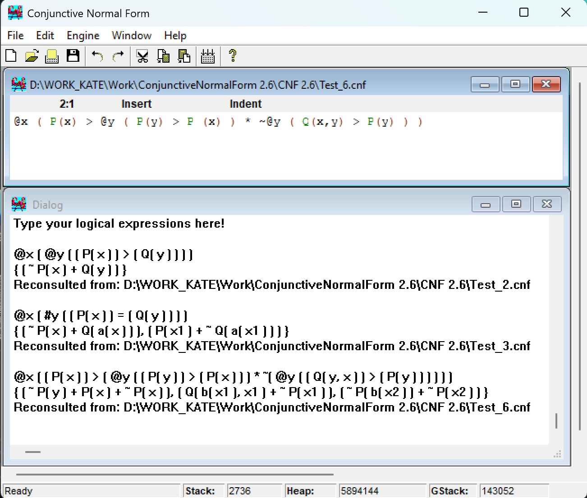
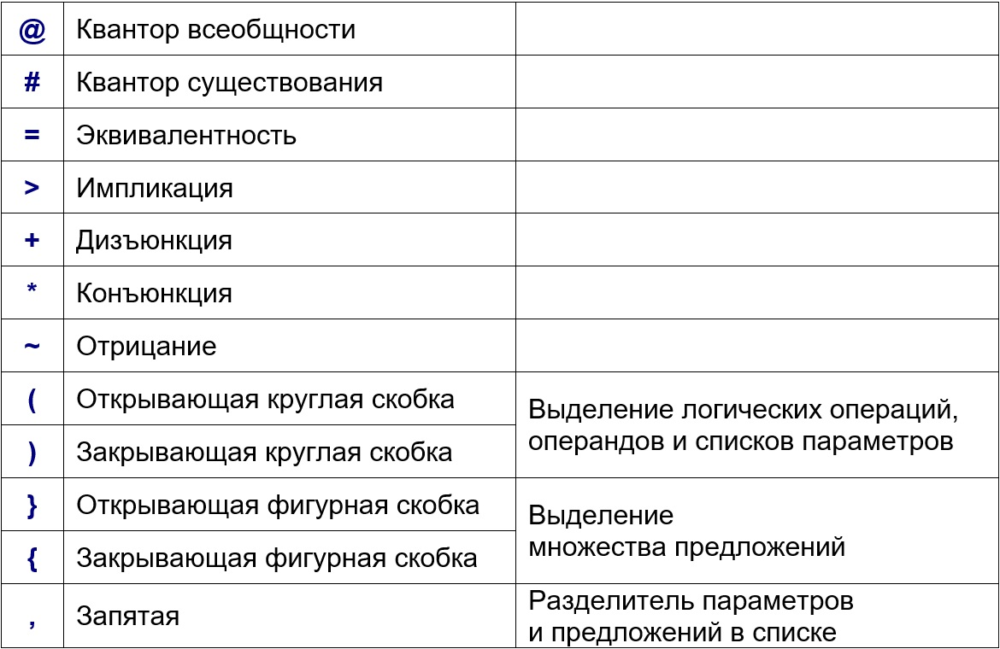
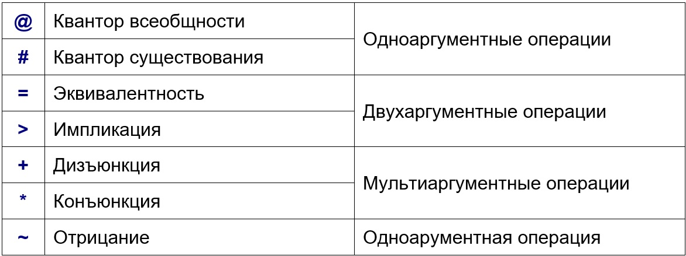

# Адаптированный логический язык (АЛЯ) и транслятор в конъюнктивную нормальную форму на Visual Prolog (Conjunctive Normal Form)

## Постановка задачи
Разнообразие правильно построенных форм (ППФ) исчисления высказываний и исчисления предикатов требует, чтобы для их анализа и использования в процедуре доказательства формулы были бы приведены к некоторой единообразной нормальной форме.
Такой формой является совокупность дизъюнктов — предложений, к которой всегда может быть приведена произвольная ППФ.

Таким образом, есть задача преобразования произвольной формулы к конъюнктивной нормальной форме (КНФ) — S1 \* S2 \* … \* Sn — и записи её в виде множества S = { S1, S2, …, Sn }, где Si = L1 \+ L2 \+ … \+ Lk — дизъюнкция, Li — литерал (предикат или отрицание предиката).

Для представления произвольной формулы в поставленной задаче достаточно удобно использовать запись из множества доступных символов клавиатуры латинской раскладки — **адаптированный логический язык (АЛЯ)**.
Он не описан в международных стандартах.

**Транслятор в конъюнктивную нормальную форму (CNF)** выполняет требуемое преобразование формулы, записанной на АЛЯ, на которую накладываются ограничения, а именно формула изначально не должна содержать:
- множеств предложений;
- множеств, записанных в фигурных скобках;
- констант;
- функций.
 
## Алфавит АЛЯ
Алфавит адаптированного логического языка (АЛЯ) составляют буквы латинского алфавита, как строчные, так и прописные, цифры, символ подчёркивания, а так же специальные символы.
В АЛЯ используются только отдельные специальные символы (для лаконичности записи и удобства восприятия), которые имеют специальное значение:

Незначащие символы, такие, как пробел, табуляция и символ перевода на новую строку, игнорируются и нужны для определения границ лексем языка и визуальной понятности формул.

АЛЯ — упрощённый язык, поэтому здесь нет никаких заголовочных структур и специальных разделов описаний. Фактически вся программа на АЛЯ для транслятора в конъюнктивную нормальную форму (CNF) состоит из одной логической формулы, которая по сути дела является единственным разделом операторов.

## Предикаты
Предикаты не нуждаются в специальном объявлении и могут размещаться как в локальных областях кванторов, так и вне их.
Предикат всегда имеет список параметров — параметры, перечисленные через запятую и заключённые в круглые скобки, помещённые за именем предиката, от которых он зависит.

Параметры предикатов в адаптированном логическом языке (АЛЯ) могут быть трёх видов:
- константы;
- переменные;
- функции.

Но константы и функции не должны встречаться в программах на АЛЯ для транслятора в конъюнктивную нормальную форму (CNF).
Они автоматически подбираются транслятором на этапе сколемизации при замене переменных, объявленных исключаемыми кванторами всеобщности.

Все переменные параметров предиката должны быть объявлены кванторами, в общей области видимости которых находится данный предикат.
Причём не обязательно предикат зависит ото всех внешних относительно него объявленных переменных.

В частном случае предикат может вообще не зависеть от каких-либо параметров.
В этом случае может указываться только одно его имя или имя с пустыми круглыми скобками следом за ним.

Имена предикатов могут повторяться.
Тогда, теоретически, предикаты с одинаковыми именами должны интерпретироваться как один предикат с разным набором параметров, количество которых должно быть постоянным для всех появлений предиката.
Но, практически, в программах на АЛЯ для CNF идентификация различных реализаций предиката не проводится и поэтому каждое возникновение предиката с ранее употреблённым именем воспринимается как новый предикат, значит, и количество параметров в списках предикатов также не проверяется.

Имя предиката может состоять из прописных и строчных букв латинского алфавита, символа подчёркивания и цифр и должно начинаться с прописной латинской буквы.

Предикаты без параметров и с параметрами-переменными могут употребляться в программах на АЛЯ для CNF. И их имена не претерпевают никаких изменений даже при трансляции в конъюнктивную нормальную форму.

*Примеры*:
- PxD123 — предикат без параметров;
- Q3_ ( ) — предикат без параметров;
- Bn ( x, z, u ) — предикат от трёх параметров-переменных;
- A ( z, S, g ( x, m ) ) ) — предикат от трёх параметров: переменной, константы и функции от двух переменных.

## Константы
Константы не нуждаются в специальном объявлении и размещаются в списках параметров предикатов.

Имя константы должно быть уникально и не принадлежать множеству имён предикатов.
Оно может состоять из прописных и строчных букв латинского алфавита, символа подчёркивания и цифр и должно начинаться с прописной латинской буквы.

Константы не должны встречаться в программах на адаптированном логическом языке (АЛЯ) для транслятора в конъюнктивную нормальную форму (CNF).
Они автоматически подбираются транслятором на этапе сколемизации при замене переменных, объявленных исключаемыми кванторами всеобщности.

Принцип выбора нового уникального имени константы следующий: последовательно с наращиванием длины от одного символа до бесконечности (теоретически) с инкрементом в один символ просматриваются по алфавиту все слова, состоящие из заглавных латинских букв, и среди них выбирается первое, не принадлежащее множеству имён известных констант и предикатов.

Поэтому практически получается, что имена констант в CNF состоят только из заглавных латинских букв.

*Примеры*:
- A;
- WX;
- Ccd;
- NuRnP;
- F__;
- N_qcF;
- Z10;
- X15_18shkR_.

## Переменные
Переменные сначала объявляются, а потом могут использоваться в списках параметров функций и предикатов.

Для введения новой переменной перед ней должен присутствовать специальный символ-конферансье.
В адаптированном логическом языке (АЛЯ) их два: @ (квантор всеобщности) и # (квантор существования), каждый из которых имеет также операторную функцию.
Одной объявляемой переменной соответствует один символ-конферансье.

Имена переменных могут повторяться. Тогда в локальной области переменная с именем, соответствующим двум ранее объявленным переменным, будет интерпретироваться как переменная, находящаяся на более глубоком уровне вложенности областей, то есть объявленная позже.

Имя переменной может состоять из прописных и строчных букв латинского алфавита, символа подчёркивания и цифр и должно начинаться со строчной латинской буквы или символа подчёркивания.

Переменные могут употребляться в программах на АЛЯ для транслятора в конъюнктивную нормальную форму (CNF). Но их имена могут претерпеть изменения на этапах разделения переменных в кванторах и предложениях.

На этапе разделения переменных в кванторах принцип выбора нового уникального имени переменной в пределах квантора следующий.
Последовательно просматриваются в ширину и глубину все области кванторов, и формируется список использованных имён переменных.
В каждой такой области имя объявленной текущим квантором переменной проверяется на принадлежность к множеству имён использованных переменных.
Если оно принадлежит к данному множеству, то заменяется на подобранное: последовательно с наращиванием длины от одного символа до бесконечности (теоретически) с инкрементом в один символ просматриваются по алфавиту все слова, состоящие из строчных латинских букв, и среди них выбирается первое, не принадлежащее множеству имён использованных переменных.

На этапе разделения переменных в предложениях принцип выбора нового уникального имени переменной в пределах предложения следующий.
Последовательно просматриваются все предложения, и формируется список использованных имён переменных. В каждом предложении каждое имя переменной проверяется на принадлежность к множеству имён использованных переменных.
Если оно принадлежит к данному множеству, то заменяется на подобранное: последовательно с наращиванием индекса от одного до бесконечности (теоретически) с инкрементом в один просматриваются все слова, состоящие из исходного имени переменной с добавленным вычисленным индексом, и среди них выбирается первое, не принадлежащее множеству имён использованных переменных.

*Примеры*:
- a;
- wX;
- ccd;
- nuRnP;
- _;
- _Tn;
- f__;
- n_qcF;
- z10;
- x15_18shkR_.

## Функции
Функции не нуждаются в специальном объявлении и размещаются в списках параметров предикатов.

Функция всегда имеет список переменных — переменные, перечисленные через запятую и заключённые в круглые скобки, помещённые за именем функции, от которых она зависит.

Все переменные функции в трансляторе в конъюнктивную нормальную форму (CNF) должны были быть объявленными кванторами всеобщности, исключёнными после сколемизации (в результате чего и возникла данная функция), в общей области видимости которых находился предикат, зависящий от данной функции.
Причём количество переменных функции равно количеству исключённых внешних кванторов всеобщности, включавших предикат, содержащий функцию.

В частном случае функция может вообще не зависеть от каких-либо параметров.
Однако, функция без переменных – это константа, поэтому функции такого вида не употребляются как в CNF, так и в адаптированном логическом языке (АЛЯ).

Имя функции должно быть уникально и не принадлежать множеству имён переменных.

Оно может состоять из прописных и строчных букв латинского алфавита, символа подчёркивания и цифр и должно начинаться со строчной латинской буквы или символа подчёркивания.

Функции не должны встречаться в программах на АЛЯ для CNF.
Они автоматически подбираются транслятором на этапе сколемизации при замене переменных, объявленных исключаемыми кванторами всеобщности.

Принцип выбора нового уникального имени функции следующий: последовательно с наращиванием длины от одного символа до бесконечности (теоретически) с инкрементом в один символ просматриваются по алфавиту все слова, состоящие из строчных латинских букв, и среди них выбирается первое, не принадлежащее множеству имён известных функций и переменных.

Поэтому практически получается, что имена функций в CNF состоят только из строчных латинских букв.

*Примеры*:
- a( x );
- wX( _1, q12 );
- ccd( a, d );
- nuRnP( w, op );
- _( n );
- _Tn( tn, tN );
- f__( a, iR ).

## Операции
Внутреннее представление элементов транслятора в конъюнктивную нормальную форму (CNF) определяет специфическую интерпретацию операций адаптированного логического языка (АЛЯ).

Все операции в CNF делятся на три вида по количеству аргументов, принимающих в них участие:
- одноаргументные;
- двухаргументные;
- мультиаргументные.

Аргументом операции может быть предикат или внутренняя операция.

Ниже для конкретной реализации АЛЯ в CNF  операции расположены по убыванию приоритета:

## Одноаргументные операции
К одноаргументным операциям относятся:
- квантор всеобщности (@);
- квантор существования (#);
- отрицание (~).

Запись квантора (всеобщности или существования) состоит из трёх элементов:
- знак квантора (@ или #);
- переменная;
- аргумент.

Переменная, указанная следом за знаком квантора, называется немой или собственной переменной квантора.

Разные кванторы могут иметь собственные переменные с одинаковыми именами, но внутри аргумента квантора все появления переменной с именем таким же, как у собственной переменной данного квантора, интерпретируются как применения собственной переменной.

На этапе трансляции разделения переменных в кванторах переменные переименовываются так, что каждому квантору соответствует переменная с именем, не совпадающим с именами других собственных переменных.

На последующих этапах трансляции все кванторы постепенно исключаются.

Запись отрицания состоит из двух элементов:
- знак отрицания (~);
- аргумент.

После преобразования в конъюнктивную нормальную форму аргументом отрицания становится только предикат.

*Примеры*:
- @ x  P( x ) — квантор всеобщности от предиката, где x — собственная переменная, от которой зависит предикат-аргумент P;
- \# y @ x A( x, y ) — квантор существования от квантора всеобщности от предиката, где y и x — собственные переменные соответствующих кванторов, от которых зависит предикат-аргумент внутреннего квантора A;
- \# z ( Q( z ) + B( z ) ) ) — квантор существования от дизъюнкции, где z — собственная переменная, от которой зависят предикаты-аргументы дизъюнкции Q и B;
- \# n ( H( n ) + @ n R( n ) ) ) — квантор существования от дизъюнкции, где n — собственная переменная, от которой зависит предикат-аргумент дизъюнкции H, а второй аргумент — квантор всеобщности от предиката где n — собственная переменная, совпадающая именем с внешней переменной, но предикат-аргумент R зависит от переменной n, объявленной позже — во внутреннем кванторе общности.
- ~  P( x ) — отрицание предиката;
- ~ @ y Q( y ) — отрицание квантора;
- ~ ( # x A( x ) + B ( y ) ) — отрицание дизъюнкции;
- ~ ~ C( n ) — отрицание отрицания.

## Двухаргументные операции
К двухаргументным операциям относятся:
- эквивалентность (=);
- импликация (>).

Запись двухаргументной операции (эквивалентности или импликации) состоит из трёх элементов:
- левый аргумент;
- знак операции (= или >);
- правый аргумент.

Поскольку эти операции имеют высокий приоритет и к тому же импликация не обладает свойством коммутативности ( A > B не эквивалентно B > A), они выполняются последовательно: просматриваются элементы до обнаружения знака операции и записываются в левый аргумент, а остальные элементы после знака операции — в правый аргумент и далее распознавание операций происходит в глубину — внутри выделенных аргументов.

На этапах трансляции все двухаргументным операции преобразуются в операции с более низкими приоритетами.

*Примеры*:
- A = B — эквивалентность предикатов, где предикат А — левый аргумент, а предикат В — правый;
- A + B = C \* D — эквивалентно ( A + B ) = ( C \* D ) — эквивалентность дизъюнкции и конъюнкции;
- A > B > C — эквивалентно A > ( B > C ) —импликация предиката и импликации двух предикатов;
- A + B > C = D \* F — эквивалентно ( ( A + B ) > C ) = ( D \* F ) — эквивалентность импликации (импликация дизъюнкции и предиката) и конъюнкции.

## Мультиаргументные операции
К мультиаргументным операциям относятся:
- дизъюнкция (+);
- конъюнкция (\*).

Запись мультиаргументной операции (дизъюнкции или конъюнкции) состоит из последовательности аргументов, расположенных через знаки операции (+ или \*).

Поскольку эти операции имеют низкий приоритет и к тому же обладают свойствами коммутативности ( A + B эквивалентно B + A) и ассоциативности ( ( A \* B ) * С эквивалентно A \* ( B \* С ) эквивалентно A \* B \* С ), они выполняются группой: просматриваются элементы до обнаружения знака операции и заносятся в начало списка аргументов как очередной аргумент, затем остальные аргументы ищутся среди оставшихся элементов после знака операции и далее распознавание операций происходит в глубину — внутри каждого из выделенных аргументов.

После преобразования в конъюнктивную нормальную форму исходная логическая формула становится конъюнкцией дизъюнкций, и эти дизъюнкции записываются как множество предложений.

На этапах трансляции все двухаргументным операции преобразуются в операции с более низкими приоритетами.

*Примеры*:
- ( A + B ) + С — эквивалентно A + ( B + С ) — эквивалентно A + B + С — дизъюнкция трёх предикатов;
- ( A > B ) + С + ( D = E ) — дизъюнкция трёх аргументов: импликации, предиката и эквивалентности;
- A \* B + С — эквивалентно ( A \* B ) + С  — дизъюнкция двух аргументов: конъюнкции двух предикатов и предикат.,

## Интерпретация скобочных выражений
Скобочные выражения, которые могут присутствовать в исходной формуле, не хранятся в её внутреннем представлении, организованным транслятором в конъюнктивную нормальную форму (CNF).

Скобки определяют границы элементов адаптированного логического языка (АЛЯ).

В исходной формуле могут встречаться дополнительные скобки, при удалении которых значение формулы не изменяется
Они скорее, несут смысловую нагрузку обеспечения визуальной понятности формулы.

Для программирования на АЛЯ в CNF приняты некоторые правила употребления скобочных выражений к элементам языка.

### Константы
Теоретически в АЛЯ константа во внешних дополнительных скобках воспринимается без них, но в программах для CNF константы не используются, а автоматически подбираются транслятором, поэтому не имеют дополнительных внешних скобок.

*Примеры*:
- P ( x, ( ( Y ) ) ) ==> P ( x, Y );
- Q ( ( A ) ) ==> Q ( A ).

### Переменные
Переменная во внешних дополнительных скобках воспринимается без них.

*Примеры*:
- P ( x, ( ( y ) ) ) ==> P ( x, у ;
- Q ( ( a ) ) ==> Q ( a );
- f ( h, ( ( ( w ) ) ) ) ==> f ( h, w );
- g ( ( ( s ) ) ) ==> g ( s );
- \# ( ( z ) ) R ( z ) ==> # z R ( z ).

### Функции
Теоретически в АЛЯ функция во внешних дополнительных скобках воспринимается без них, но в программах для CNF функции не используются, а автоматически подбираются транслятором, поэтому не имеют дополнительных внешних скобок.
Функция обязательно имеет собственные скобки, в которых находится список её переменных.

*Примеры*:
- P ( x, ( ( f ( y ) ) ) ) ==> P ( x, f ( y ) );
- Q ( ( g ( z ) ) ) ==> Q ( g ( z ) ).

### Предикаты
Предикат во внешних дополнительных скобках воспринимается без них.
Предикат имеет собственные скобки, в которых находится список его параметров.
В предикате без параметров скобки могут быть опущены.

*Примеры*:
- @ x ( ( P ( x ) ) ) ==> @ x P ( x );
- ( ( Q ( y ) ) ) > R ( y ) ==> Q ( y ) > R ( y );
- S (  ) ==> S.

### Отрицание
Отрицание во внешних дополнительных скобках воспринимается без них.
Отрицание обязательно имеет собственные скобки, если его аргументом является двух- или мультиаргументная операция.

*Примеры*:
- ~ ( ( P ( x ) ) ) ==> ~ P ( x );
- ~ ( ( @ y Q ( y ) ) ) ==> ~ @ y Q ( y );
- ~ ( ( ~ R ( z ) ) ) ==> ~ ~ R ( z );
- ~ ( ( S ( m ) > T ) ) ==> ~ ( S ( m ) > T );
- ~ ( ( V + W ) ) ==> ~ ( V + W ).

### Кванторы
Квантор во внешних дополнительных скобках воспринимается без них.
Знак квантора и собственная переменная, заключённые во внешние дополнительные скобки, также интерпретируются без них.
Квантор обязательно имеет собственные скобки, если его аргументом является выражение, не являющееся предикатом или квантором.

*Примеры*:
- ( ( # x P ( x ) ) ) ==> # x P ( x );
- ( ( @ y ) ) Q ( x ) ==> @ y Q ( x );
- @ z ( ( R ( z ) ) ) ==> @ z R ( z );
- @ x ( ( # y S ( x, y ) ) ) ==> @ x # y S ( x, y );
- \# z ( ( ~ @ w Q ( w ) ) ) ==> # z ( ~ @ w Q ( w ) );
- \# m ( ( S ( m ) > T ) ) ==> # m ( S ( m ) > T );
- @ x ( ( V + W ( x ) ) ) ==> @ x ( V + W ( x ) ).

### Двух- и мультиаргументные операции
Двух- или мультиаргументная операция во внешних дополнительных скобках воспринимается без них.
Двух- или мультиаргументная операция должна быть заключена в скобки, если является аргументом отрицания, квантора или другой двух- или мультиаргументной операции, чей приоритет ниже данной операции.
Аргумент двух- или мультиаргументной операции должен быть записан в скобках, если он является другой двух- или мультиаргументной операцией с более высоким приоритетом.
Скобки не играют роли для аргумента двух- или мультиаргументной операции, который также является двух- или мультиаргументной операцией того же вида, за исключением левого аргумента импликации, который обязательно должен быть помещён в скобки, если также является импликацией.

*Примеры*:
- \# x ( ( A = B ) ) ==> # x ( A = B );
- ~ ( ( C > D ) ) ==> ~ ( C > D );
- @ y ( ( E + F ) ) ==> @ y ( E + F );
- A + ( ( B \* C ) ) ==> A + B \* C;
- ( ( A + B ) ) \* C ==> ( A + B ) \* C;
- C > ( ( D > E ) ) ==> C > D > E;
- ( ( C > D ) ) > E ==> ( C > D ) > E.

## Преобразование логических формул к множеству предложений
### Исключение эквивалентностей (=) и импликаций (>)
Многократно, пока возможно, применяется правило: если найдено самое первое присутствие двухаргументной операции — эквивалентности или импликации, то производятся замены:
- F = Ф ==> ( ~ F + Ф) \*( F + ~ Ф);
- F > Ф ==> ~ F + Ф.

### Продвижение знака отрицания (~) до атома
Многократно, пока возможно, производятся замены:
- ~ ~ F ==> F;
- ~ ( F + Ф) ==> ~ F \* ~ Ф;
- ~ ( F * Ф) ==> ~ F \* + Ф;
- ~ @ x  F( x ) ==> # x  ~ F( x );
- ~ # x  F( x ) ==> @ x  ~ F( x ).

### Разделение переменных
В пределах области действии квантора переменная, связываемая с этим квантором, представляет собой немую переменную.
Её повсюду можно заменить любой другой (не встречающейся) переменной в пределах области действия квантора, при этом значение истинности этой правильно построенной формулы (ППФ) не изменится.
Стандиртизация переменных в пределах ППФ означает переименование немых переменных с той целью, чтобы каждый квантор имел свою, свойственную только ему, немую переменную.

### Сколемизация — исключение кванторов существования
Если квантор существования не входит в область действия никакого из кванторов общности, то вместо его собственной переменной применяется сколемовская функция без аргументов, то есть просто константа.
Если квантор существования входит в область действия m кванторов общности, то каждое присутствие собственной переменной квантора существования заменяется m-местной функцией fi( x1, x2, …, xm ), зависящей от переменных кванторов общности.

### Преобразование в префиксную нормальную форму
На этом этапе не осталось кванторов существования, и каждый квантор общности можно переместить в начало ППФ и считать, что область действия каждого квантора включает всю последующую часть ППФ.
Тогда результирующая ППФ находится в префиксной нормальной форме.
Правильно построенная формула в префиксной форме состоит из цепочки кванторов, называемой префиксом, и следующей за ней безквантороной формулы, называемой матрицей.

### Приведение матрицы к конъюнктивной нормальной форме
Любая матрица может быть записана как конъюнкция конечного множества дизъюнкций литералов: M = S1 \* S2 \* … \* Sn, где Si = L1 + L2 + … + Li, Li — литерал.
Когда в формуле исключены все скобки между одинаковыми связками, то в рассматриваемой дизъюнкции ищется первая попавшаяся конъюнкция, происходят преобразования, а затем в каждом из полученных дизъюнктов операция продолжается до тех пор, пока в дизъюнкциях не будут присутствовать только атомы (предикаты) и/или их отрицания:
Ф1 + Ф2 + … + Фr + ( U1 \* U2 \* … \* Us) эквивалентно
(Ф1 + Ф2 + … + Фr + U1 ) \*
(Ф1 + Ф2 + … + Фr + U2 ) \*
…
(Ф1 + Ф2 + … + Фr + Us ).

### Исключение кванторов общности
Поскольку все переменные в формулах связаны кванторами общности и порядок кванторов общности роли не играет, можно не указывать явно вхождения кванторов.
Тогда остаётся лишь матрица КНФ.

### Исключение символов конъюнкции (\*)
Дизъюнкты представляются в виде множества ППФ.
Любая ППФ, состоящая только из дизъюнкции литералов, называется предложением.

## Переименование переменных
Символы переменных должны быть изменены так, чтобы каждый появлялся не более, чем в одном предложение.

## Статус проекта
Проект завершён.

## Контакты
Котова Екатерина Александровна,
e-mail: katekotova_86@mail.ru